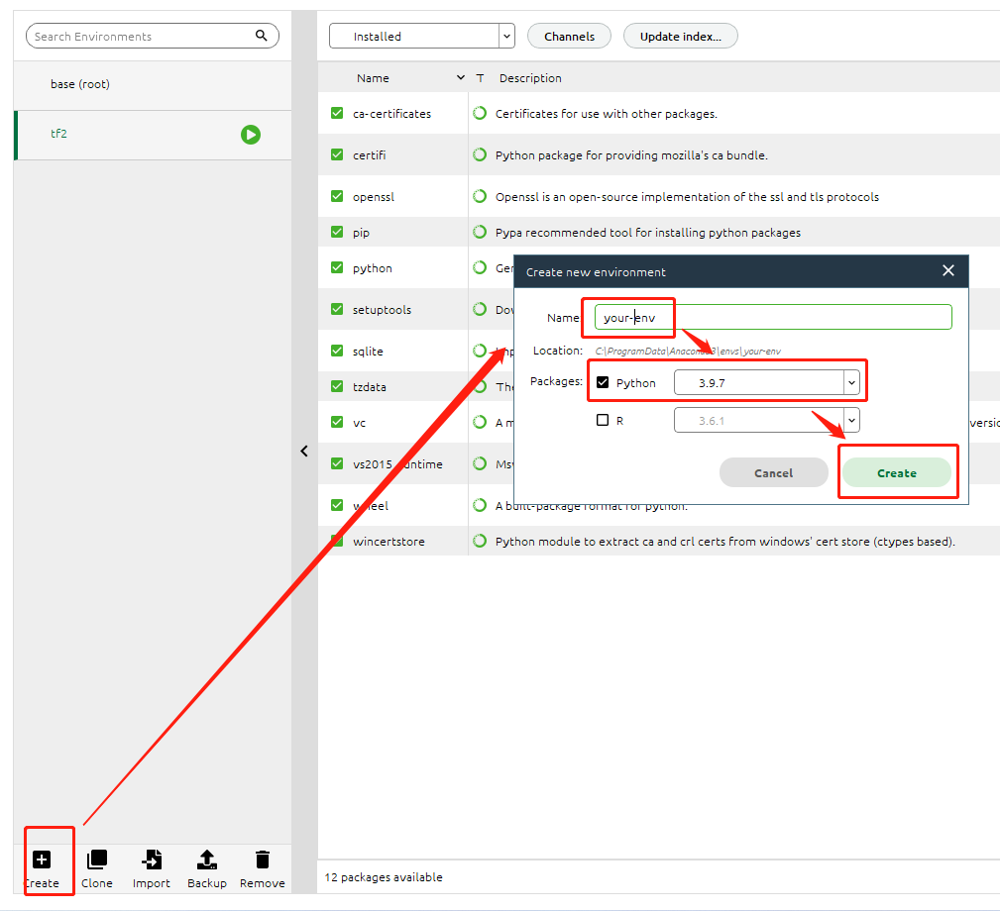
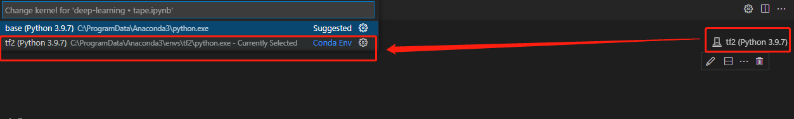
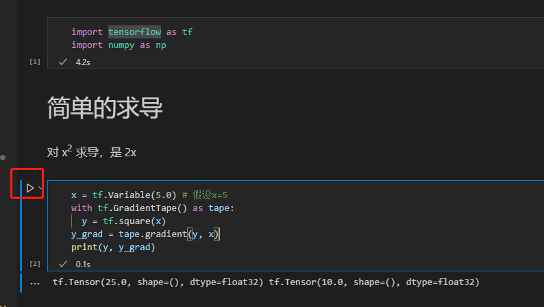

#  深度学习


本文章比较新手向，高手轻喷


## 下载anaconda


https://mirrors.tuna.tsinghua.edu.cn/anaconda/archive/


> anaconda包含python，并且可以创建多个环境


## 使用conda的清华源


原始的源在国外，比较慢，我们换成国内的源


打开“用户”目录下的“.condarc”，修改为下面内容
>  Windows 用户无法直接创建名为 “.condarc” 的文件，可先执行 ```conda config --set show_channel_urls yes``` 生成该文件之后再修改。


```yml
channels:
  - defaults
show_channel_urls: true
default_channels:
  - https://mirrors.tuna.tsinghua.edu.cn/anaconda/pkgs/main
  - https://mirrors.tuna.tsinghua.edu.cn/anaconda/pkgs/r
  - https://mirrors.tuna.tsinghua.edu.cn/anaconda/pkgs/msys2
custom_channels:
  conda-forge: https://mirrors.tuna.tsinghua.edu.cn/anaconda/cloud
  msys2: https://mirrors.tuna.tsinghua.edu.cn/anaconda/cloud
  bioconda: https://mirrors.tuna.tsinghua.edu.cn/anaconda/cloud
  menpo: https://mirrors.tuna.tsinghua.edu.cn/anaconda/cloud
  pytorch: https://mirrors.tuna.tsinghua.edu.cn/anaconda/cloud
  pytorch-lts: https://mirrors.tuna.tsinghua.edu.cn/anaconda/cloud
  simpleitk: https://mirrors.tuna.tsinghua.edu.cn/anaconda/cloud
```


## 创建tensorflow环境





现在可以激活这个环境


```bash
conda activate tf2
```


并且在这个环境下安装各种依赖库了


```bash
conda install tensorflow
```


## 打开这个项目的jupyter记事本


[./tape.ipynb](./tape.ipynb)


或者自己创建一个新的.ipynb文件


## 选择ipynb的核





现在可以运行每一行代码了





## 第三方安装


查找
```bash
anaconda search -t conda jieba
```


Name                      |  Version | Package Types   | Platforms       | Builds
------------------------- |   ------ | --------------- | --------------- | ----------
auto/jieba                |     0.32 | conda           | linux-64, linux-32 | py27_0 : http://github.com/fxsjy
conda-forge/jieba         |   0.42.1 | conda           | linux-64, win-32, osx-64, noarch, win-64 | py27_0, py36_0, pyh9f0ad1d_1, pyhd8ed1ab_0, py_1, py35_0 : Chinese Words Segementation Utilities
conda-forge/jieba3k       |   0.35.1 | conda           | linux-64, win-32, win-64, noarch, osx-64 | py36_1, py37h9c2f6ca_1004, py37h9c2f6ca_1005, py36hc560c46_1002, py36hc560c46_1003, py37h4c0cbd9_1005, py37h4c0cbd9_1004, py38h50d1736_1005, py38h50d1736_1004, py_0, py310h2ec42d9_1005, py37h89c1867_1004, py35_1001, py36h5fab9bb_1004, py37hf985489_1005, py37hf985489_1004, py37h89c1867_1005, py36h9f0ad1d_1002, py36h9f0ad1d_1003, py37hc8dfbb8_1003, py37hc8dfbb8_1002, py38h578d9bd_1004, py38h578d9bd_1005, py39hf3d152e_1004, py39hf3d152e_1005, py36h79c6626_1004, py37h03978a9_1005, py37h03978a9_1004, py310h5588dad_1005, py39h6e9494a_1004, py36_1001, py39h6e9494a_1005, py39hde42818_1003, py310hff52083_1005, py36ha15d459_1004, py38_1001, py36hd000896_1004, py37_1001, py37h5186d4c_1005, py37h5186d4c_1004, py39hcbf5309_1004, py39hcbf5309_1005, py35_1, py38haa244fe_1004, py38haa244fe_1005, py38h32f6830_1003, py38h32f6830_1002: Chinese Words Segementation Utilities
creditx/jieba             |     0.38 | conda           | linux-64        | py35_0, py27_0
hargup/jieba              |          | conda           | linux-64        | py27_0 : Chinese Words Segementation Utilities
iilab/jieba               |   0.36.2 | conda           | linux-64, osx-64 | py34_0 : Chinese Words Segementation Utilities
iilab/jieba3k             |   0.35.1 | conda           | linux-64, osx-64 | py34_0 : Chinese Words Segementation Utilities
jiangxiluning/jieba       |   0.36.2 | conda           | linux-64, win-64, osx-64 | py27_0 : Chinese Words Segementation Utilities
moustik/jieba             |     0.38 | conda           | linux-64        | py27_0
r/r-jiebard               |      0.1 | conda           | noarch          | r36h6115d3f_0 : jiebaR is a package for Chinese text segmentation, keyword extraction and speech tagging. This package provides the data files required by jiebaR.
r_test/r-jiebard          |      0.1 | conda           | noarch          | r36h6115d3f_0 : jiebaR is a package for Chinese text segmentation, keyword extraction and speech tagging. This package provides the data files required by jiebaR.
syllabs_admin/jieba       |     0.39 | conda           | linux-64        | py27ha286e51_0


可以看见``` conda-forge/jieba  ```应该是我们想要的


这时候显示全部内容


```bash
anaconda show conda-forge/jieba
```

可以看到第三方安装地址

```
Name:    jieba
Summary: Chinese Words Segementation Utilities
Access:  public
Package Types:  conda
Versions:
   + 0.38
   + 0.39
   + 0.42.1

To install this package with conda run:
     conda install --channel https://conda.anaconda.org/conda-forge jieba
```


第三方安装


```
conda install --channel https://conda.anaconda.org/conda-forge jieba
```